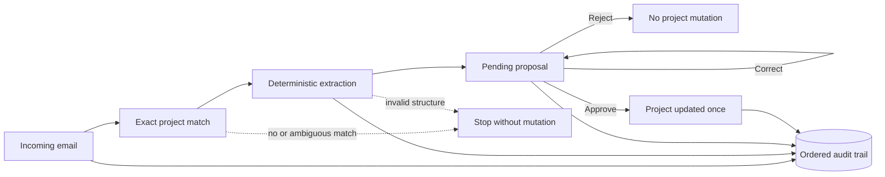

# ProjectOps Workflow

Project updates often arrive as semi-structured email. Copying them into a
project system by hand is slow, but allowing automation to change project state
without review is risky.

ProjectOps Workflow is a local reference implementation of a safer pattern:
turn an incoming message into a structured proposal, require an explicit human
decision, and preserve an ordered audit trail of what happened.

> Automation may propose a change. It cannot approve its own work.

This repository contains a working MVP, not a production SaaS or
client-delivered product. It runs entirely on local synthetic data and needs no
secrets or third-party services.

## Solution

The workflow separates interpretation from authority:

1. Ingest an RFC 822 email fixture.
2. identify exactly one configured project.
3. extract a structured update deterministically.
4. store the proposal as `pending` without changing the project.
5. let a human correct, reject, or approve it.
6. apply an approved proposal once and record every material transition.

## Workflow



## Architectural decisions

- **Approval-first state changes.** Extraction and review are separate
  responsibilities; a proposal remains inert until approval.
- **Deterministic extraction.** The baseline parses labelled fields rather than
  calling an LLM, making the demo reproducible and secret-free.
- **Local, dependency-free runtime.** Python's standard library and SQLite are
  enough to exercise the product contract.
- **Stable identities and replay checks.** Message content and identifiers
  support duplicate detection and reject a reused `Message-ID` with different
  content.
- **Explicit failure over guessing.** No match, multiple matches, malformed
  updates, and invalid corrections stop before project mutation.

## Safety and reliability properties

The included acceptance suite checks the bounded local implementation for:

- no project mutation while a proposal is pending;
- safe correction and rejection;
- approval applied exactly once in the current SQLite persistence boundary;
- duplicate ingestion returning the existing proposal;
- fail-closed ambiguous, unmatched, unstructured, and conflicting messages;
- correction-schema validation; and
- reconstructable ordered audit events.

These are local application guarantees, not distributed exactly-once delivery,
tamper-proof logging, authentication, or production security claims.

## Demo

Requirements: Python 3.10 or newer. No package installation is needed.

Run the complete happy path from a clean temporary database:

```bash
python3 demo.py
```

The demo shows the initial project, a pending proposal with no mutation, a human
correction, approval, the resulting project, duplicate handling, and the audit
sequence. The temporary database is removed when the run finishes.

For individual CLI commands:

```bash
DB=/tmp/projectops-workflow.sqlite3
rm -f "$DB"

python3 projectops.py init --db "$DB" --projects sample_data/projects.json
python3 projectops.py ingest --db "$DB" \
  --source sample_data/inbox/acme_weekly_update.eml
python3 projectops.py proposals --db "$DB" --state pending
```

Use the emitted `proposal_id` with `projectops.py review --help` to correct,
reject, or approve the proposal. The automated demo is the shortest walkthrough.

## Tests and evidence

Run the focused acceptance suite:

```bash
python3 -m unittest discover -s tests -v
```

The suite contains seven tests covering the workflow contract described above.
See the concise [case study](docs/CASE_STUDY.md) for scope, tradeoffs, and the
public-repository acceptance record.

## Limitations

- Local email files and a synthetic project fixture only; there is no Gmail or
  other live inbox integration.
- Deterministic labelled-field extraction only; there is no live LLM/provider.
- Human identity is an actor string, not an authenticated user or authorization
  system.
- SQLite audit records are inspectable but not tamper-proof.
- No hosting, multi-tenancy, RBAC/SSO, queues, external CRM/project-system
  adapter, or production operations layer.
- No external user, buyer, customer outcome, or production environment has been
  validated.

## Technology

Python standard library, SQLite, RFC 822 email parsing, JSON fixtures, and
`unittest`. The implementation intentionally has no runtime dependency on an AI
provider, workflow platform, or external service.

## License

[MIT](LICENSE) © 2026 Gustavo Bataller.
